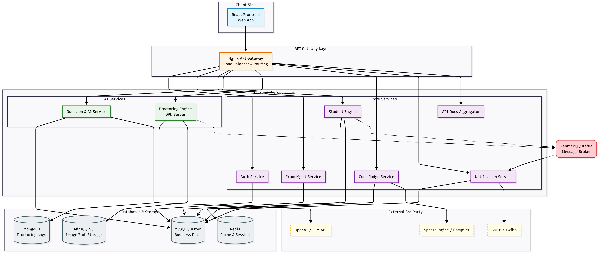

# **SMTS – AI Proctored Examination System**

SMTS is a full-scale AI-powered online examination platform designed to ensure **secure, scalable, and intelligent remote assessments**.
The system enables institutions, professors, and students to conduct and participate in exams with advanced **AI proctoring**, real-time monitoring, automated evaluation, question generation, and support for programming-based practical exams.

This project follows a **microservices-driven architecture** to ensure modularity, easier scaling, independent deployments, and clean separation of responsibilities.

---

## 🚀 **Project Overview**

The system consists of:

### **🔹 Frontend (Web Application)**

* Built using **React.js**
* Student , Admin & Professor dashboards
* Exam UI with autosave, timer protection, and secure environment
* Integrated camera/microphone access for proctoring
* Real-time monitoring UI for professors

### **🔹 Backend (Microservices Architecture)**

Backend is split into multiple independent FastAPI-based microservices handling authentication, exam management, student engine, question bank, AI proctoring, code judge integration, notifications, and API documentation.

Each microservice has its own responsibilities, database layer, internal APIs, and can scale independently.

### **🔹 Databases**

* **MySQL** → Core structured transactional data (users, exams, questions, submissions, results, notifications)
* **MongoDB** → High-volume event logs & AI proctoring data
* **S3/MinIO Storage** → Captured proctoring images

### **🔹 Supporting Services**

* **Redis** → Autosave & timer state caching
* **RabbitMQ** → Asynchronous pipelines for AI analysis & notifications
* **NGINX Gateway** → Single entry point for all microservices
* **API Docs Service** → Merged OpenAPI documentation for the entire ecosystem

---

## 🏗️ **High-Level Architecture**

Below is the system architecture diagram used to visualise microservices, data flow, and infrastructure.





---

## 📂 **Repository Structure (Overview)**

This planning repo contains the overall system outline.
Detailed breakdowns are separated into dedicated documentation files.

```
   ├── microservices-overview.md
   ├── database-schema.md
   └── deployment-strategy.md 
```

---

## 📘 **Additional Documentation**

The following guides provide deeper technical details:

### 🔸 **Microservices Breakdown**

Located at:
`docs/microservices-overview.md`
Contains a complete explanation of all services, their responsibilities, and internal communication flow.

---

### 🔸 **Database Schema**

Located at:
`docs/database-schema.md`
Contains full MySQL + MongoDB schema designs, ER diagrams, naming conventions, and table relationships.

---

### 🔸 **Deployment Strategy**

Located at:
`docs/deployment-strategy.md`
Covers CI/CD pipelines, Docker containerization, image management, and server deployment models.

---

## 🎯 **Goal of This Repository**

This repo acts as the **central planning and documentation hub** for the SMTS AI Proctoring System.
It gives new contributors, architects, and stakeholders a complete overview of:

* How the system works
* What components exist
* How microservices communicate
* How the backend and frontend are structured
* How the project will scale in production

---

