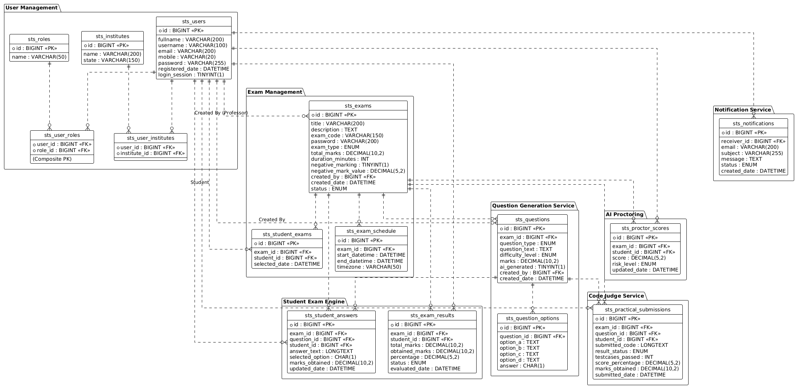
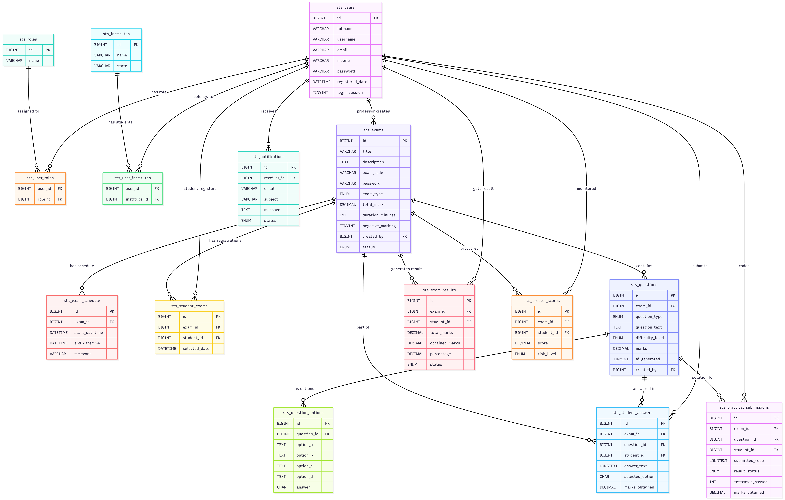

# # **AI Proctoring System — Database Schema Documentation**

This document describes the complete database structure for the **AI Proctored Examination System**.
The system uses **MySQL** for core structured data and **MongoDB** for AI proctoring logs.

---

# 🖼️ **Database Architecture Diagrams**

### **1️⃣ Service-wise Schema (Image)**



---

### **2️⃣ MySQL Database Schema Diagram**




---

# 🟦 **MYSQL DATABASE SCHEMA**

All tables are stored in the following database:

### ⭐ **Database Name: `sts_proctor_ai`**

This DB contains all structured + transactional data across all microservices.

---

# 🔵 **1. AUTHENTICATION & USER MANAGEMENT SERVICE**

---

## **Table: `sts_users`**

| column_name     | type                | notes  |
| --------------- | ------------------- | ------ |
| id              | BIGINT PK AI        |        |
| fullname        | VARCHAR(200)        |        |
| username        | VARCHAR(100) UNIQUE |        |
| email           | VARCHAR(200) UNIQUE |        |
| mobile          | VARCHAR(20)         |        |
| password        | VARCHAR(255)        | hashed |
| registered_date | DATETIME            |        |
| login_session   | TINYINT(1)          | 1 or 0 |

---

## **Table: `sts_roles`**

| column_name | type         |
| ----------- | ------------ |
| id          | BIGINT PK AI |
| name        | VARCHAR(50)  |

---

## **Table: `sts_user_roles`**

| column_name | type                     |
| ----------- | ------------------------ |
| user_id     | BIGINT FK → sts_users.id |
| role_id     | BIGINT FK → sts_roles.id |

**Primary Key:** (user_id, role_id)

---

## **Table: `sts_institutes`**

| column_name | type         |
| ----------- | ------------ |
| id          | BIGINT PK AI |
| name        | VARCHAR(200) |
| state       | VARCHAR(150) |

---

## **Table: `sts_user_institutes`**

| column_name  | type      |
| ------------ | --------- |
| user_id      | BIGINT FK |
| institute_id | BIGINT FK |

---

# 🔵 **2. EXAM MANAGEMENT SERVICE**

---

## **Table: `sts_exams`**

| column_name         | type                                           | notes                         |
| ------------------- | ---------------------------------------------- | ----------------------------- |
| id                  | BIGINT PK AI                                   |                               |
| title               | VARCHAR(200)                                   |                               |
| description         | TEXT                                           |                               |
| exam_code           | VARCHAR(150) UNIQUE                            | student finds exam using code |
| password            | VARCHAR(200)                                   | required before exam start    |
| exam_type           | ENUM('Objective','Subjective','Practical')     |                               |
| total_marks         | DECIMAL(10,2)                                  |                               |
| duration_minutes    | INT                                            |                               |
| negative_marking    | TINYINT(1)                                     |                               |
| negative_mark_value | DECIMAL(5,2)                                   |                               |
| created_by          | BIGINT FK                                      | professor user_id             |
| created_date        | DATETIME                                       |                               |
| status              | ENUM('Draft','Scheduled','Active','Completed') |                               |

---

## **Table: `sts_exam_schedule`**

| column_name    | type         |
| -------------- | ------------ |
| id             | BIGINT PK AI |
| exam_id        | BIGINT FK    |
| start_datetime | DATETIME     |
| end_datetime   | DATETIME     |
| timezone       | VARCHAR(50)  |

---

## **Table: `sts_student_exams`**

**Meaning:** Which student selected which exam using exam name + exam code.

| column_name   | type         |
| ------------- | ------------ |
| id            | BIGINT PK AI |
| exam_id       | BIGINT FK    |
| student_id    | BIGINT FK    |
| selected_date | DATETIME     |

---

# 🔵 **3. QUESTION SERVICE (Question Bank + AI Generation)**

---

## **Table: `sts_questions`**

| column_name      | type                                       |
| ---------------- | ------------------------------------------ |
| id               | BIGINT PK AI                               |
| exam_id          | BIGINT FK NULL                             |
| question_type    | ENUM('Objective','Subjective','Practical') |
| question_text    | TEXT                                       |
| difficulty_level | ENUM('Easy','Medium','Hard')               |
| marks            | DECIMAL(10,2)                              |
| ai_generated     | TINYINT(1)                                 |
| created_by       | BIGINT FK                                  |
| created_date     | DATETIME                                   |

---

## **Table: `sts_question_options`**

| column_name   | type         | notes                   |
| ------------- | ------------ | ----------------------- |
| id            | BIGINT PK AI |                         |
| question_id   | BIGINT FK    |                         |
| question_text | TEXT         |                         |
| option_a      | TEXT         |                         |
| option_b      | TEXT         |                         |
| option_c      | TEXT         |                         |
| option_d      | TEXT         |                         |
| answer        | CHAR(1)      | values: 'a','b','c','d' |

---

# 🔵 **4. STUDENT ENGINE (Answer Submission + Timer)**

---

## **Table: `sts_student_answers`**

| column_name     | type          | notes                |
| --------------- | ------------- | -------------------- |
| id              | BIGINT PK AI  |                      |
| exam_id         | BIGINT FK     |                      |
| question_id     | BIGINT FK     |                      |
| student_id      | BIGINT FK     |                      |
| answer_text     | LONGTEXT NULL | subjective/practical |
| selected_option | CHAR(1) NULL  | objective (a/b/c/d)  |
| marks_obtained  | DECIMAL(10,2) | default 0            |
| updated_date    | DATETIME      |                      |

---

## **Table: `sts_exam_results`**

| column_name    | type                |
| -------------- | ------------------- |
| id             | BIGINT PK AI        |
| exam_id        | BIGINT FK           |
| student_id     | BIGINT FK           |
| total_marks    | DECIMAL(10,2)       |
| obtained_marks | DECIMAL(10,2)       |
| percentage     | DECIMAL(5,2)        |
| status         | ENUM('Pass','Fail') |
| evaluated_date | DATETIME            |

---

# 🔵 **5. CODE JUDGE SERVICE**

---

## **Table: `sts_practical_submissions`**

| column_name      | type                               |
| ---------------- | ---------------------------------- |
| id               | BIGINT PK AI                       |
| exam_id          | BIGINT FK                          |
| question_id      | BIGINT FK                          |
| student_id       | BIGINT FK                          |
| submitted_code   | LONGTEXT                           |
| result_status    | ENUM('Success','Failed','Partial') |
| testcases_passed | INT                                |
| testcases_total  | INT                                |
| score_percentage | DECIMAL(5,2)                       |
| marks_obtained   | DECIMAL(10,2)                      |
| submitted_date   | DATETIME                           |

---

# 🔵 **6. NOTIFICATION SERVICE**

---

## **Table: `sts_notifications`**

| column_name  | type                            |
| ------------ | ------------------------------- |
| id           | BIGINT PK AI                    |
| receiver_id  | BIGINT FK                       |
| email        | VARCHAR(200)                    |
| subject      | VARCHAR(255)                    |
| message      | TEXT                            |
| status       | ENUM('Pending','Sent','Failed') |
| created_date | DATETIME                        |
| sent_date    | DATETIME                        |

---

# 🔵 **7. PROCTORING — (AI Summary Moved to MySQL)**

---

## **Table: `sts_proctor_scores`**

| column_name  | type                        |
| ------------ | --------------------------- |
| id           | BIGINT PK AI                |
| exam_id      | BIGINT FK                   |
| student_id   | BIGINT FK                   |
| score        | DECIMAL(5,2)                |
| risk_level   | ENUM('Low','Medium','High') |
| updated_date | DATETIME                    |

---

# 🟩 **MONGODB DATABASE — `sts_proctor_logs`**

---

## **Collection: `proctor_frames`**

```
{
  _id: ObjectId,
  exam_id: Number,
  student_id: Number,
  timestamp: ISODate(),
  image_url: "s3://bucket/path/frame123.jpg",
  gaze_direction: "CENTER"|"LEFT"|"RIGHT"|"DOWN",
  multiple_faces_detected: Boolean,
  phone_detected: Boolean,
  face_confidence: Number
}
```

---

## **Collection: `proctor_events`**

```
{
  _id: ObjectId,
  exam_id: Number,
  student_id: Number,
  event_type: "TAB_SWITCH"|"AUDIO_SPIKE"|"MULTIPLE_PERSON"|"PHONE"|"NO_FACE",
  timestamp: ISODate(),
  additional_info: { ... }
}
```

---

## **Collection: `proctor_analysis_logs`**

```
{
  _id: ObjectId,
  exam_id: Number,
  student_id: Number,
  log_type: "GAZE" | "AUDIO" | "FACE" | "PHONE",
  timestamp: ISODate(),
  details: {
      raw_probabilities: {...},
      model_version: "v1.2.3",
      confidence_score: Number,
      notes: "Face partially visible"
  }
}
```

---

# 🟣 **FINAL SUMMARY**

### ✔ MySQL (`sts_proctor_ai`) stores:

* Users, roles, institutes
* Exams, schedules
* Student-exam selection
* Questions & options
* Student answers & results
* Practical submissions
* Notifications
* Proctoring AI scores

### ✔ MongoDB (`sts_proctor_logs`) stores:

* Frame metadata
* Event logs
* Raw AI analysis logs

---

